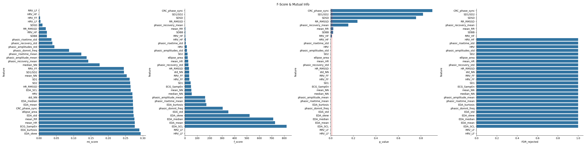
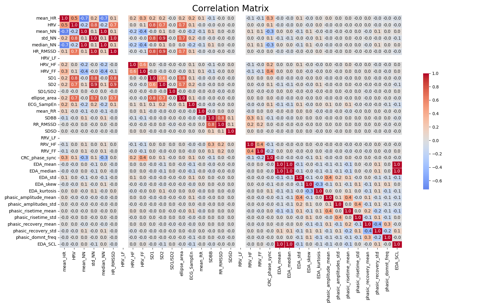
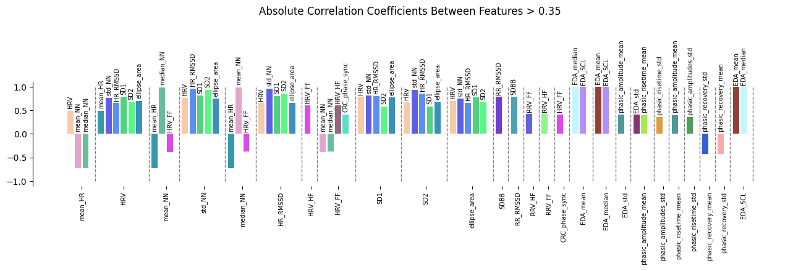
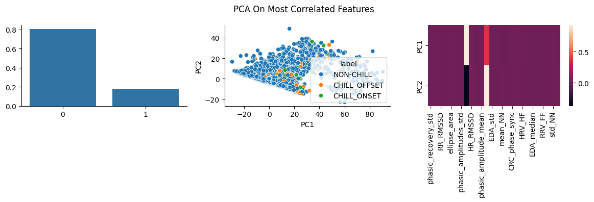
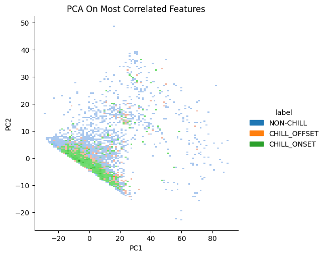
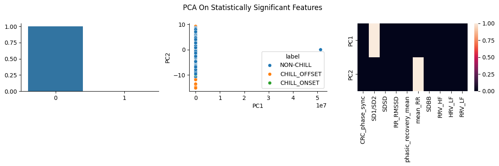
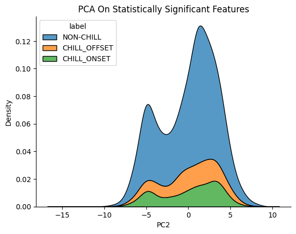

# A. Descriptive Statistics

### ECG Features

#### Normal or Symmetric Distributions
- **Features:** `mean_HR`, `mean_NN`, `median_NN`
- **Characteristics:**
  - Mean and median are similar for each class indicating symmetric distributions.
  - Mean/median slightly higher in `CHILL-OFFSET` for `mean_HR`.
  - Mean/median slighty lower in `CHILL-OFFSET` FOR `mean_NN` and `median_NN`.
  - Symmetric or approximately **normal distribution**.
  - Multimodal like distribution for `CHILL-OFFSET` and `CHILL-ONSET` in `mean_HR`.
  - Coefficient of variation (CV) is **less than 20%** for most.
  - Significant outliers across classes, except
  - Similar and significantly overlapping distributions across classes.

#### Right-Skewed Distributions with Moderate Variability (CV > 20%)
- **Features:** `HRV`, `std_NN`, `HR_RMSSD`, `HRV_HF`, `HRV_FF`, `ECG_SampEn`
- **Characteristics:**
  - Median is lower than the mean in each class for these variables, indicating **right skewness**; this is with the exception of `HRV_FF` and `ECG_SampEn` which is les dissimilar indicating a more **symmetric distribution**.
  - Moderate to high coefficient of variation **(20% - 175%)**.
  - Outliers in **right tail**.
  - Significant overlap between distribution classes.
  - `HRV`, `std_NN`, and `HR_RMSSD` have the **highest CV values (~100%-175%)**.

#### Strongly Right-Skewed Distributions with Extreme Outliers
- **Features:** `SD1`, `SD2`, `SD1/SD2`, `ellipse-area`
- **Characteristics:**
  - Extremely right-skewed distributions.
  - **Extreme outliers in the right tail** (especially `SD1/SD2` and `ellipse-area`).
  - **Very high coefficient of variation (> 100%)**, indicating high variability.
  - `SD1/SD2` has **extreme variability**, meaning the **median** is a better measure of central tendency.

#### Multimodal Distributions
- **Features:** `mean_HR`, `HRV_FF`
- **Characteristics:**
  - Distributions show **multiple peaks**.
  - `HRV_FF` has **few outliers**, mostly in `NON-CHILL` and `CHILL-OFFSET`.
  - `mean_HR` has **multimodal patterns** in `CHILLS_ONSET` and `CHILLS_OFFSET`.

>#### Physiological Interpretation
>- Increase in `mean_HR` from `NON-CHILL` to `CHILL-ONSET` to `CHILL-OFFSET` suggesting arousal or stmulation during chills. 
>  - This is reversed in `mean_NN` and `median_NN`.
>- Multimodal distributions indicate distinct respsonse patterns to musical stimuli or different type of chill experiences. Multimodal distributions observed in:
>  - `mean_HR`: `CHILL-ONSET`, `CHILL-OFFSET`
>  - `HRV_FF`: All phase.
>- Decrease in `HRV` and `HR_RMSSD` from `NON-CHILL` to `CHILL-ONSET` to `CHILL-OFFSET`.
>  - More stable cardiac activity/regulations during chills.
>- Decreased `HR_RMSSD` variability during chills.
>- Decrease of `mean_HR` variability during chills suggest more stable heart rates during chills.
>- Slight fluctuation in `HRV` variability during `CHILLS-ONSET`.

### Tips for Modelling
>#### Feature Selection:
>- `mean_HR`, `mean_NN`, and `median_NN` show promising stability.
>- High variability features may need transformation.
>- Consider removing or transforming `SD1/SD2` due to extreme outliers.
>
>#### Data Preprocessing:
>- Robust scaling recommended for skewed features.
>- Outlier treatment crucial for `SD1/SD2` and `HRV`.
>- Consider log transformation for right-skewed features.
>
>#### Model Selection:
>- High overlap suggests need for non-linear classifiers.
>- Consider ensemble methods to handle different feature distributions.
>- Robust models recommended due to outlier presence.

### Respiratory Features:

#### Normal/Symmetric Distributions
`mean_RR`, `RR_RMSSD`, `SDSD`
- Variability:
  - `mean_RR`: Low CV (16-17%)
  - `RR_RMSSD`: Moderate CV (20-31%)
  - `SDSD`: Higher CV (49-68%)
- Outliers:
  - `mean_RR`: Few outliers, mainly in left tail for `CHILLS-OFFSET`.
  - `SDSD & RR_RMSSD`: Right tail outliers across classes.
  - Similar mean and median indicating symmetric distribution.
- Patterns:
  - `mean_RR` shows slight elevation during chills (both onset and offset).
  - High stability in base respiratory rate.
  - Significant overlap between class distributions.
- Classification Implications:
  - `mean_RR` alone may not be discriminative enough.
  - Stability measures might be more useful in combination.
  - Consider interaction terms between these features.

#### Right Skewed Distributions
`RRV_HF`, `RRV_FF`, `SDBB`
- Variability:
  - Extremely high CV (>120%)
  - `RRV_HF` shows highest variability (>500%)
  - `SDBB`: Very high CV (200-233%)
- Outliers:
  - Significant right tail outliers across all conditions
- Patterns:
  - `RRV_FF`: Progressive increase from non-chills to offset
  - `RRV_HF`: Highest in offset, lowest in onset
  - `SDBB`: Decreased during onset, increased during offset
- Classification Implications:
  - Will need transformation for modeling
  - Extreme values could be informative
  - Consider using quantile-based features

### Physiological Interpretations:
>- Maintained basic respiratory control (stable `mean_RR`).
>- Increased variability during chill episodes.
>- Distinct recovery patterns in offset.

### Tips for Modelling
>#### Feature Engineering Strategies
>- Log transformation for skewed features.
>- Consider rolling windows for variability measures.
>- Ratio features between normal and skewed distributions.
>- Quantile-based features for highly variable measures.
>
>#### Model Selection
>- Need robust handling of outliers
>- Non-linear relationships suggest tree-based methods.
>- Consider ensemble methods to capture different feature characteristics.
>
>#### Class Separability
>- Best separation potential:
>   - `RRV_FF` between `NON-CHILL` and `CHILL-OFFSET`.
>   - `SDBB` between `CHILL-ONSET` and `CHILL-OFFSET`.
>   - `RRV_HF` for extreme responses.
>- Challenging separation:
>   - `mean_RR` between any conditions
>   - Normal distribution features in general
>
>#### Recommendations
>- Use feature combinations rather than individual measures
>- Consider temporal sequences
>- Include interaction terms
>- Apply appropriate scaling/transformation for each distribution type

### EDA Features

#### Normal/Symmetric Distributions
`EDA_mean`, `EDA_median` 
- Variability:
  - Moderate CV (40-50%) for non-chills and onset  
  - High CV (90-100%) for offset  
- Outliers:
  - Few outliers, mostly balanced between tails  
- Patterns:
  - Increase from `NON-CHILL` to `CHILL-ONSET` and significatn decrease in `CHILL-OFFSET`.
  - `CHILL-ONSET` shows highest values (0.69-0.70)  
  - `CHILL-OFFSET` shows marked decrease (0.32-0.35)  
  - Strong overlap between `NON-CHILL` and `CHILL-ONSET`  distributions.
- Classification Implications:
  - Good discriminators for `CHILL-OFFSET`.
  - Less useful for `NON-CHILL` vs `CHILL-ONSET` distinction.  

#### Right-Skewed Distributions
`phasic_amplitude_mean`, `phasic_amplitudes_std`, `EDA_std`  
- Variability:
  - Very high CV (160-470%)  
  - Highest variability in phasic measures  
- Outliers:  
  - Significant right-tail outliers across all conditions  
- Patterns:
  - `phasic_amplitude_mean` is highest in offset.  
  - Increased variability during chills (both onset and offset)  
  - Limited overlap between conditions in extreme values  
- Classification Implications:
  - May need transformation for modeling.
  - Extreme values could be useful features.
  - High variability suggests need for robust scaling.  

#### Highly Skewed with Complex Patterns
`EDA_skew`, `EDA_kurtosis`, `phasic_domnt_freq`  
- Variability:
  - Extremely high CV (>200%). 
  - Most variable during offset.
- Outliers:  
  - Extreme outliers in both tails. 
- Patterns:
  - Complex, non-linear relationships between conditions.  
  - Significant overlap in distributions.
  - Higher moments (`EDA_skew`, `EDA_kurtosis`) show distinct patterns.  
- Classification Implications:
  - May require non-linear modeling approaches. 
  - Potential for interaction features.  
  - Could be useful for detecting extreme responses.  

### Physiological Interpretation:
>- Clear arousal during onset.
>- Distinct recovery pattern during offset.
>- Individual differences in response magnitude. 
>- Temporal dynamics could be important.

### Tips On Modelling
>#### Feature Engineering:
>- Consider log-transformation for skewed features.  
>- Potential for ratio features between normal and skewed measures.
>- May benefit from rolling statistics (variance, range). 
>
>#### Model Selection:
>- Need robust handling of outliers.  
>- Models should account for high variability.
>- Non-linear relationships suggest tree-based methods might work well.  
>
>#### Class Separability:
>- Best separation for offset condition.  
>- Onset vs non-chills more challenging.  
>- Multiple features needed for reliable classification.  

---

# B. Statistical Testing

#### Mutual Information 
***(Leftmost/First Plot left-to-right)***
- Higher values indicate stronger statistical dependency between the feature and the class labels.
- EDA features (`EDA_mean`, `EDA_median`, `EDA_SCL`) show relatively high mutual information.
- Some ECG features (`ECG_SampEn`) also show moderate mutual information

#### ANOVA F-test
***The center-left plot shows F-statistic values***
***The center-right plot sows p-values***
- Tests the independence between features and class labels.
- Higher values suggest stronger relationships.
- Higher values indicate greater between-class variance compared to within-class variance
- `EDA_SCL`, `EDA_mean`, and `EDA_median` show notably high F-statistic values, 
this aligns with the MI scores.

#### FDR (False Discovery Rate) Rejection of Null Hypitheis:
***Rightmost plot***
- Controls for multiple comparisons.
- Boolean true bars indicate more statistically significant relationships.
- Most features show significant relationships (high bars indicating low p-values).

### Key implications:

>#### Feature Importance:
>- `EDA (electrodermal activity)` features appear to be the most discriminative for detecting chills.
>- This suggests that `skin conductance changes` are more reliable indicators than heart-related measures
`ECG features` show moderate but significant relationships.
>
>#### Statistical Significance:
>- The low p-values values suggest these relationships are not due to chance.
>- Multiple features show significant discriminative power.
>- The consistency across different statistical tests strengthens the findings.
>
>#### Classification Potential:
>- The strong statistical relationships suggest these features could be effective for automated chills detection.
>- A combination of EDA and ECG features might provide the most robust classification.
>- The varying importance of different features suggests a weighted feature approach might be beneficial.
>- This analysis implies that physiological responses during musical chills are detectable and statistically distinct from non-chill periods, with skin conductance being particularly informative.

---
# C. Correlations

### Observations & Inference
- Strong correlations between `HRV` features: (`HRV_LF, HRV_HF, SD1, SD2, RR_RMSSD`). Redundant features can be dropped to avoid overfitting.
- EDA features (`EDA_mean, EDA_median, EDAD_SCL`), are stronlgy correlated. Also the `CHILL-OFFSET` distribution of these features is right-skewed opposed to that of other classes which is left-skewed; these can be useful in physiological states classification.
- Strong negatiev correlation between `HRV` and `mean_HR` can be useful for classification of stress and relaxation states.

### PCA on Correlated & Statistically Significant Features

- Overlapping distributions confirm the need for non-linear classifiers.